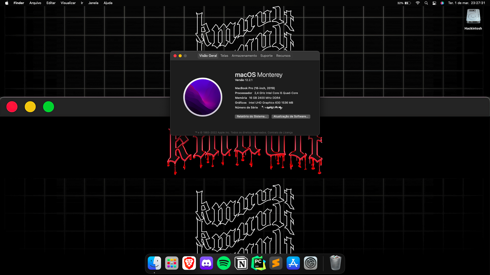

<h1 align="center">
  
   
    Acer Nitro 5 AN515-54W2 - Hackintosh
</h1>
<h6 align="center">macOS Monterey no Acer Nitro 5 AN515-54W2.</h6>

<h6 align="center">[Inglês](README.md) | [Português](README-pt-BR.md)</h6>

 

## Configuração

| Modelo                                                                                               | Acer Nitro 5 AN515-54W2                                |
|------------------------------------------------------------------------------------------------------|--------------------------------------------------------|
| Processador                                                                                          | Intel® Core™ i5-9300H                                  |
| Placa de Vídeo                                                                                       | Nvidia GeForce® GTX 1050 3GB & Intel® UHD Graphics 630 |
| RAM                                                                                                  | 2x 8GB 2400MHz DDR4                                    |
| Disco                                                                                                | Kingston® 256gb PCIe® NVMe™                            |
| Áudio                                                                                                | Realtek HD Audio ALC255                                |
| Wifi                                                                                                 | Intel® Wireless-AC 9560 160MHz                         |
| Ethernet                                                                                             | RealTek RTL8168/8111 PCI-E Gigabit Ethernet            |
| HC-I2C                                                                                               | Intel® Serial IO I2C - A368/A369                       |
| HC-GPIO                                                                                              | Intel® Serial IO GPIO - INT3450                        |
| Touchpad                                                                                             | ELAN 0504                                              |
| BIOS                                                                                                 | V1.33                                                  |
| [OpenCore](https://github.com/acidanthera/OpenCorePkg)                                               | V0.7.8                                                 |
| [CFG Lock](https://www.reddit.com/r/hackintosh/comments/hz2rtm/cfg_lockunlocking_alternative_method) | Destravado (CPU Power Management & Kernel(XNU))        |

## Funcionando

- ✅ Áudio (Entrada & Saída)
- ✅ Câmera + Microfone
- ✅ GPU Integrada
- ✅ ACPI Brilho da Tela
- ✅ Ethernet
- ✅ Suspender + Acordar
- ✅ Touchpad Inteligente + Gestos
- ✅ Portas USB & Type C
- ✅ WiFi (2.4Ghz & 5GHz) e Bluetooth
- ✅ Suporte nativo a teclas de atalho Fn
- ✅ iServiços (Messages, FaceTime, etc.)

## Não Funcionando

- ❌ GTX 1050 (Sem compatibilidade com as GPU's NVIDIA desde o High Sierra).
- ❌ Porta HDMI (Saída da GTX 1050).

## Créditos

- Obrigado [dortania](https://dortania.github.io/OpenCore-Install-Guide) por providenciar o guia completo.
- Obrigado [hackintosh-stuff](https://github.com/hackintosh-stuff/ComboJack) por providenciar a correção da porta de áudio.
- Agradecimento especial a [dmsNitro5](https://github.com/dmsNitro5/EFI-Acer-Nitro-5-AN515-54-574Q) e [PowerBall253](https://github.com/PowerBall253/AN515-54-Hackintosh) por fornecer sua configuração, que me ajudou a obter 100% de sucesso na build.

<h3 align="center">
Aviso Legal:
</h3>
<h4 align="center">
Feito apenas para fins pessoais/educativos.
 
Eu não sou responsável por qualquer computador brickado/desconfigurado
</h4>