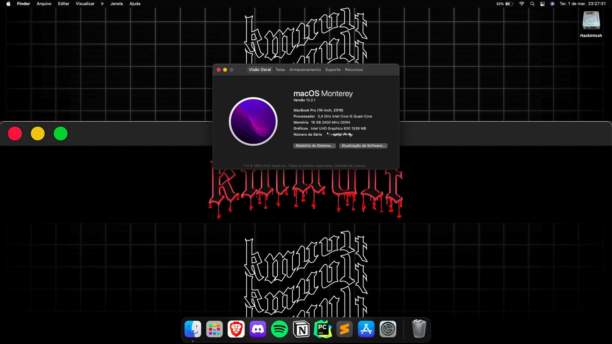

<h1 align="center">
  
   
    Acer Nitro 5 AN515-54W2 - Hackintosh
</h1>
<h6 align="center">macOS Monterey on Acer Nitro 5 AN515-54W2.</h6>

 

## Configuration

| Model                                                                           | Acer Nitro 5 AN515-54W2                                |
|---------------------------------------------------------------------------------|--------------------------------------------------------|
| Processor                                                                       | Intel® Core™ i5-9300H                                  |
| Graphics                                                                        | Nvidia GeForce® GTX 1050 3GB & Intel® UHD Graphics 630 |
| RAM                                                                             | 2x 8GB 2400MHz DDR4                                    |
| Disk                                                                            | Kingston® 256gb PCIe® NVMe™                            |
| Audio                                                                           | Realtek HD Audio ALC255                                |
| Wifi                                                                            | Intel® Wireless-AC 9560 160MHz                         |
| Ethernet                                                                        | RealTek RTL8168/8111 PCI-E Gigabit Ethernet            |
| HC-I2C                                                                          | Intel® Serial IO I2C - A368/A369                       |
| HC-GPIO                                                                         | Intel® Serial IO GPIO - INT3450                        |
| Touchpad                                                                        | ELAN 0504                                              |
| BIOS                                                                            | V1.33                                                  |
| [OpenCore](https://github.com/acidanthera/OpenCorePkg)                          | V0.7.8                                                 |
| [CFG Lock](https://www.reddit.com/r/hackintosh/comments/hz2rtm/cfg_lockunlocking_alternative_method) | Unlocked (CPU Power Management & Kernel(XNU))          |

## What's working

- ✅ Audio (Input & Output)
- ✅ Webcam + Microphone
- ✅ iGPU
- ✅ ACPI Display brightness
- ✅ Ethernet
- ✅ Sleep + Wake
- ✅ Smart Touchpad + Gestures
- ✅ USB & Type C Ports
- ✅ WiFi (2.4Ghz & 5GHz) and Bluetooth
- ✅ Native hotkey support with Fn keys
- ✅ iServices (Messages, FaceTime, etc.)

## What's not working

- ❌ GTX 1050 (NVIDIA GPU's compatibility dead since High Sierra).
- ❌ HDMI port (Output from GTX 1050).

## Credits

- Thanks to [dortania](https://dortania.github.io/OpenCore-Install-Guide) for providing the full guide.
- Thanks to [hackintosh-stuff](https://github.com/hackintosh-stuff/ComboJack) for providing audio jack fix
- Special thanks to [dmsNitro5](https://github.com/dmsNitro5/EFI-Acer-Nitro-5-AN515-54-574Q) and [PowerBall253](https://github.com/PowerBall253/AN515-54-Hackintosh) for providing their configuration, which helped me getting this build 100%.

<h3 align="center">
Disclaimer:
</h3>
<h4 align="center">
Made for personal/educational purposes only.
 
I'm not responsible for any misconfigured/bricked computer
</h4>